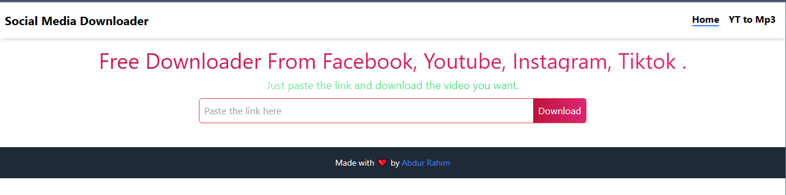

# Social Media Video Downloader
This is a simple social media video downloader. It can download videos from Facebook, Instagram, Tiktok, and YouTube. It is built with React, Vite, and Tailwind CSS.

## Usage
1. Clone this repository
```bash
git clone https://github.com/AbdurRaahimm/social-media-downloader.git
```
2. Go to directory
```bash
cd social-media-downloader
```
3. Run The Essential Dependency
```bash
npm install
```
4. Run `npm run dev` to start the development server
```bash
npm run dev
```
5. Run `npm run build` to build the project
```bash
npm run build
```
6. Run `npm run serve` to serve the build
```bash
npm run serve
```

## Features
- Download videos from Facebook
- Download videos from Instagram
- Download videos from TikTok
- Download videos from YouTube

## Screenshots



## Demo
[Live Demo](https://social-media-downloader-eight.vercel.app/)


## Tools Used
- React
- Vite
- Tailwind CSS
- ESLint
- Prettier


## Connect on Social Media
- [Twitter](https://twitter.com/AbdurRahim4G)
- [Instagram](https://www.instagram.com/abdurrahim4g/)
- [Facebook](https://www.facebook.com/Rahim72446)
- [LinkedIn](https://www.linkedin.com/in/abdur-rahim4g/)
- [YouTube](https://youtube.com/@AbdurRahimm)


